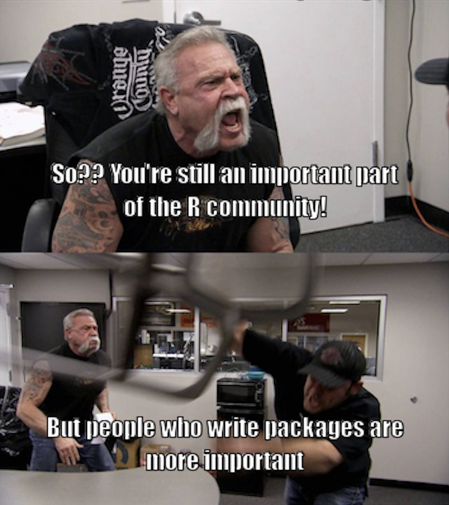
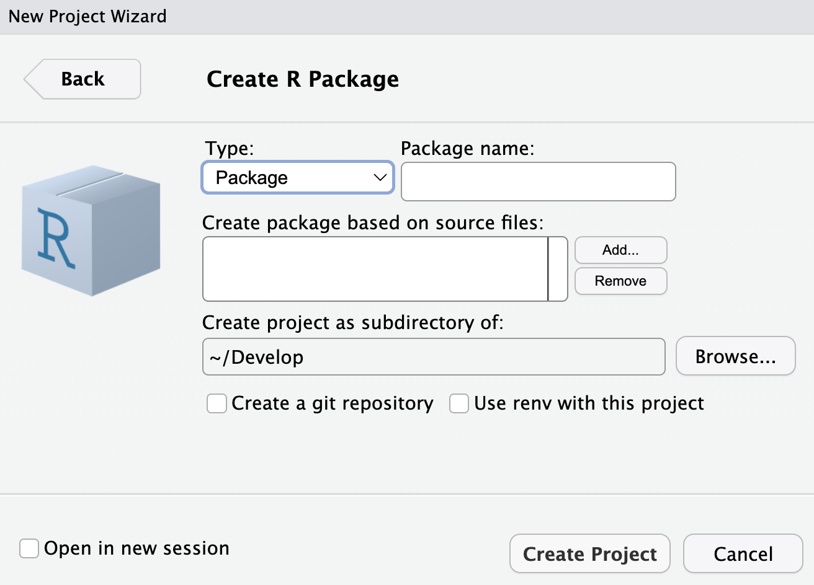

background-image: url("images/bg_web.png")
background-size: cover
class: left, bottom


```{r setup, include=FALSE}
options(htmltools.dir.version = FALSE)

library(ggplot2)
library(tidyverse)
library(readr)
library(gridExtra)
library(cowplot)

#library(jtools)


knitr::opts_chunk$set(fig.retina = 3, 
                      warning = FALSE, 
                      message = FALSE)


theme_set(theme_minimal(base_size = 20)) # sets a default ggplot theme

#has_bash <- Sys.which('bash') != '' && .Platform$OS.type != 'windows'

library(RefManageR)
bib <- ReadBib("PracticeR_FINAL.bib", check = FALSE)
ui <- "- "
```

```{r best-features, echo=FALSE}
#search
#xaringanExtra::use_search(show_icon = TRUE, position = "top-right")

xaringanExtra::use_progress_bar(color = "#023047", location = "top")
xaringanExtra::use_panelset()
xaringanExtra::use_clipboard()
xaringanExtra::use_tile_view()

```


```{r xaringan-themer, include=FALSE, warning=FALSE}
library(xaringanthemer)
style_mono_accent(
  base_color = "black",
  header_font_google = google_font("Commissioner"),
  text_font_google   = google_font("EB Garamond"),
  code_font_google   = google_font("Fira Code")
)

```


  

```{r meta, echo=FALSE}
library(metathis)
meta() %>%
  meta_general(
    description = "Slides: Put R Code in Production.",
    generator = "xaringan and remark.js"
  ) %>% 
  meta_name("github-repo" = "edgar-treischl/slidesRinProduction") %>% 
  meta_social(
    title = "Put R in Production",
    url = "https://edgar-treischl.github.io/slidesRinProduction/",
    og_type = "website",
    og_author = "Edgar J. Treischl",
    image = "https://edgar-treischl.github.io/slidesRinProduction
/images/preview.png",
    image_alt = "Preview Slide"
  )
```


```{r, results='asis', echo=FALSE}
cat(readLines("github-corner.html"), sep = "\n")
```


<h1 style="font-family: 'Bangers', sans-serif; font-size: 65px; color: #ffff;">R Package</h1>
<h1 style="font-family: 'Bangers', sans-serif; font-size: 65px; color: #ffff;">Development</h1>
<br/>

<h3><a href="http://www.edgar-treischl.de" target="_blank" style="color:#C51717;">Dr. Edgar J. Treischl</a></h3>


<br/>
.white[Last update: `r Sys.Date()`]
<br/>
<h4 style = "color:#ffff; text-align: right;">Press `r emoji::emoji("o")` or `r emoji::emoji("arrow_right")`</h4>


<div class="remark-footer"><a href="https://unsplash.com/de/@sajjadahmadi" target="_blank" style="color: gray;">Images: Sajjad Ahmadi</a></div>


```{css, echo = F}
.reduced_opacity {
  opacity: 0.5;
}
```


---
## Agenda


.pull-left[


### 01 Develop `r emoji::emoji("invent")`
### 02 Build `r emoji::emoji("construction")`
### 03 Document `r emoji::emoji("document")`
### 04 Deploy `r emoji::emoji("run")`


]

.pull-right[


]


---
## 01: Why R Packages?

### I will not create something like ggplot2, so why should I create a package anyway? `r emoji::emoji("crazy")` 

.pull-left[

- *Reusability and Distribution*: Make sure everything needed to run is available. Plus: simplifies version control, dependency management, and installation.
- *Organization and Maintainability*: A package encourages a clean and organized code, making it easier to maintain, update, and extend over time.

- *Documentation*: A package allows to include automatic documentation (help files, website, vignettes) , making it much easier for others - and the future yourself - to understand how it works.

- `r emoji::emoji("parrot")` Further Goodies


]

.pull-right[
<figure>
    <a href="https://r-pkgs.org" target="_blank">
</figure>
]


---

## 01 Document: pkgdown

.pull-left[

<div class="info-box">
  <i>`r emoji::emoji("parrot")`️</i> "The goal of pkgdown is to make it easy to make an elegant and useful package website with a minimum of work. You can get a basic website up and running in just a couple of minutes. If you’re using GitHub, we recommend setting up pkgdown and GitHub actions to automatically build and publish your site". (Wickham et al. 2024)
</div>


]

.pull-right[
<figure>
    <a href="https://pkgdown.r-lib.org" target="_blank">
</figure>
]

<br>


---
background-image: url(https://pkgdown.r-lib.org/logo.png)
background-position: 90% 5%
background-size: 8%

## 01 Document: pkgdown

### Create a pkgdown website via:

.pull-left[

```{r, eval=FALSE}
usethis::use_pkgdown()
#> creates config file: => _pkgdown.yml
```

#### Use `_pkgdown.yml` to define the website specs:

```yaml
# _pkgdown.yml
url: https://edgar-treischl.github.io/ProjectX/
template:
  bootstrap: 5
  bootswatch: litera
navbar:
...
```


]

.pull-right[

#### Build the website locally via:

```{r, eval=FALSE}
# Build the site locally
pkgdown::build_site()
```

#### Or via GitHub `r emoji::emoji("rocket")`:

```{r, eval=FALSE}
#Add corresponding GHA to deploy the website
usethis::use_pkgdown_github_pages()
```


]


---
background-image: url("https://i.gifer.com/8Bx3.gif")
background-size: cover
class: bottom, center

### .black[The package structure makes it easy to test the code `r emoji::emoji("silly")`] 


<div class="remark-footer"><a href="https://gifer.com/de/8Bx3" target="_blank" style="color: black;">Source: Gifer</a></div>

---
background-image: url(https://testthat.r-lib.org/logo.png)
background-position: 90% 5%
background-size: 8%
## 01: testthat

<br/>

<div class="info-box">
  <i>`r emoji::emoji("parrot")`</i> "Testing your code can be painful and tedious, but it greatly increases the quality of your code. testthat tries to make testing as fun as possible, so that you get a visceral satisfaction from writing tests. Testing should be addictive, so you do it all the time. (Wickham 2011)"
</div>

<br/>

.pull-left[

```{r, eval =FALSE}
#Set up the test infrastructure
# And build a test
usethis::use_test("name")
```

]

.pull-right[


]


---
background-image: url(https://covr.r-lib.org/reference/figures/logo.png)
background-position: 90% 5%
background-size: 8%
## 01: covr


.panelset[

.panel[.panel-name[Test Coverage]

.pull-left[

<div class="info-box">
  <i>`r emoji::emoji("parrot")`️</i>"Track test coverage for your R package and view reports locally or (optionally) upload the results to codecov or coveralls. (Hester 2023)"
</div>

```{r, eval =FALSE}
# Inspect the test coverage
covr::report()
```


]
.pull-right[


]


]


.panel[.panel-name[Tracked Source]
 
]

]


---
background-image: url(https://styler.r-lib.org/reference/figures/logo.png)
background-position: 90% 5%
background-size: 8%

## 01: Develop With Style(r)


.pull-left[

<div class="info-box">
  <i>`r emoji::emoji("parrot")`️️</i> "styler formats your code according to the tidyverse style guide (https://style.tidyverse.org) (or your custom style guide) so you can direct your attention to the content of your code" (Müller and Walthert 2024).
</div>


]

.pull-right[

```{r}
styler::style_text(
  "myFunction<-function( x,y){
  if(sum( x , y )==10){
    print( 'Sum is correct!' )
  }
}"
)

```

]


There are even more goodies `r emoji::emoji("bad")` if you develop an R package:

```{r, eval=FALSE}
styler::style_pkg()
```


---

# And Keep in Mind ...


<div style="display:flex; justify-content:center; gap:20px;">
  
  
</div>


---

# And Keep in Mind ...

<br>
<div style="display:flex; justify-content:center; gap:20px;">
  
</div>


---
background-image: url(https://i.gifer.com/8rTu.gif)
background-size: cover
class: bottom, center


## .white[Let's get started ... `r emoji::emoji("evil")`] 

<div class="remark-footer"><a href="https://gifer.com/de/8rTu" target="_blank" style="color: black;">Source: Mark Hamill</a></div>


---
## 02: Devtools does the Heavy Lifting `r emoji::emoji("weight")`

<div class="info-box">
  <i>`r emoji::emoji("parrot")`</i> "The aim of devtools is to make package development easier by providing R functions that simplify and expedite common tasks. R Packages is a book based around this workflow." (Wickham et al. 2022)
</div>


.pull-left[


<figure>
    <a href="https://devtools.r-lib.org" target="_blank">
</figure>

]

.pull-right[
<figure>
    <a href="https://devtools.r-lib.org" target="_blank">
</figure>
]


---
## 02: usethis


.pull-left[

<div class="info-box">
  <i>`r emoji::emoji("parrot")`</i> "usethis is a workflow package: it automates repetitive tasks that arise during project setup and development, both for R packages and non-package projects." (Wickham et al. 2022)
</div>


]

.pull-right[
<figure>
    <a href="https://usethis.r-lib.org/" target="_blank">
</figure>
]


---
background-image: url(https://usethis.r-lib.org/logo.png)
background-position: 90% 5%
background-size: 8%
## 02: usethis and Github Actions

.pull-left[

Continuous Integration/Continuous Deployment:

1. *Reliability via Automated Testing*: We can automatically run tests on every commit, ensuring that code changes don't break functionality.

2. *Consistent Environments*: CI/CD pipelines define reproducible environments, ensuring that the code runs the same way on every machine, regardless the local setup.

3. *Effortless Deployment*: With GitHub Actions, you can automate the deployment of R Markdown reports, Shiny apps, R packages, and so on.

]

.pull-right[

```yaml
# Workflow from: https://github.com/r-lib/actions/tree/v2/examples

on:
  push:
    branches: [main, master]
  pull_request:
    branches: [main, master]

name: R-CMD-check

jobs:
  R-CMD-check:
    runs-on: ubuntu-latest
    env:
      GITHUB_PAT: ${{ secrets.GITHUB_TOKEN }}
      R_KEEP_PKG_SOURCE: yes
    steps:
      - uses: actions/checkout@v3

...
```

]


---
background-image: url(https://usethis.r-lib.org/logo.png)
background-position: 90% 5%
background-size: 8%

## 02: usethis and Github Actions


Usethis has predefined workflows for:

```{r, eval = FALSE}
usethis::use_github_action()

# Which action do you want to add? (0 to exit)
# (See <https://github.com/r-lib/actions/tree/v2/examples> for other options) 
# 
# 1: check-standard: Run `R CMD check` on Linux, macOS, and Windows
# 2: test-coverage: Compute test coverage and report to https://about.codecov.io
# 3: pr-commands: Add /document and /style commands for pull requests
```


---

## 02: Create an R package ...


.pull-left[

### ... with usethis

1. Create a new Git repository and clone it ...
2. Create a new package via: 

```{r, eval=FALSE}
# create_package adds ...
usethis::create_package(here::here())
```


]

.pull-right[

### ... or use the Project Wizard

<figure>
    <a href="https://devtools.r-lib.org" target="_blank">
</figure>


]


---

## 02: Create an R package II

.pull-left[

The function sets up the following structure/files:

- **DESCRIPTION**: A “package manifest” used by R and CRAN

- *R/*: Folder for all R Files

- *man/* : Contains automatically generated .Rd documentation files, created by roxygen2

- **NAMESPACE**: Lists functions which are exposed to users (exported) and which are internal. Automatically generated by roxygen2 (e.g., @export)

- **.Rbuildignore**: All files and folders that will be ignored when building the package


]

.pull-right[

#### DESCRIPTION file:

```{bash
Package: TestPackage
Type: Package
Title: What the Package Does (Title Case)
Version: 0.1.0
Authors@R: c(
    person(
      "Jane", "Doe",
      email = "jane@example.com",
      role = c("aut", "cre")
    )
  )
Description: More about what it does (maybe more than one line).
    Continuation lines should be indented.
...

```


]


---

## 02: R Folder: Hello.R

.pull-left[

Example: `R/Hello.R` 

```{r
# Hello, world!
#
# Some useful keyboard shortcuts for package authoring:
#
#   Install Package: 'Cmd + Shift + B'
#   Check Package:   'Cmd + Shift + E'
#   Test Package:    'Cmd + Shift + T'


hello <- function() {
  print("Hello, world!")
}

```


]

.pull-right[

#### Install via:

```r
#> Install the package
devtools::install()
```

#### Test via:

```r
#> Load the package and call the function
library(playertest)
hello()

#> [1] "Hello, world!"
```


]


---

## Load it all `r emoji::emoji("rocket")`


.pull-left[


- ´load_all()´ parses all R files located in the R/ directory: `devtools` reads all R scripts in `R/`, processes the code, and converts it into internal R objects that can be used immediately

- It loads all exported functions into your session (@export).

- It compiles documentation if you’re using roxygen2


<div class="info-box">
  <i>`r emoji::emoji("parrot")`</i> This acts like hot-reloading for R development, it instantly reloads your package code into your session without needing a reinstall.
</div>


]

.pull-right[


<figure>
    <a href="https://devtools.r-lib.org" target="_blank">
</figure>


]


---

## Load it all II

#### Next steps

- Let’s add a small feature to the package, document it, and install the package again.

- For example, let's use the `praise` package to add a personalized compliment.

```{r}
# Add a new feature
hello <- function(name) {
  print(paste0("Hello ", name, praise::praise(template = ", you are ${adjective}!") ))
}
```

- Save the file, run `load_all()` and test the new `hello()` function with a name to see the enhanced greeting:


```{r}
# Load the updated package
hello("Julian")
```


---

## Load it all III

.pull-left[


- Remember: If you add external packages, you need to declare those dependencys in your DESCRIPTION file.

- To put it differently: If your package use other packages, they need to be installed when someone else installs your package.

- Add the package to your DESCRIPTION file using the `use_package()` function from the usethis package.

]

.pull-right[

#### For example:

```{r, eval=FALSE}
# Add praise to Imports
usethis::use_package("praise")
```


```
# ✔ Setting active project to "/Users/edgar/Develop/playertest".
# ✔ Adding praise to Imports field in DESCRIPTION.
# ☐ Refer to functions with `praise::fun()`.
```


]

<br>
<div class="info-box">
  <i>`r emoji::emoji("parrot")`</i> Remember to run devtools::document() after modifying the DESCRIPTION file to ensure that all dependencies are correctly recognized and documented. The same applies when you add new functions to your package.
</div>


---
background-image: url(https://i.gifer.com/15X0.gif)
background-size: cover
class: bottom, center


## .red[Documentation]

<div class="remark-footer"><a href="https://www.sarah-johnson.com/personal-art" target="_blank" style="color: black;">Source: Sarah Johnson</a></div>


---
background-image: url(https://roxygen2.r-lib.org/logo.png)
background-position: 90% 5%
background-size: 8%
## 03 Document: roxygen2

.pull-left[

#### Describe the functions and ...

<div class="info-box">
  <i>`r emoji::emoji("parrot")`️</i> "... roxygen2 will process your source code and comments to automatically generate .Rd files in man/, NAMESPACE, and, if needed, the Collate field in DESCRIPTION.". (Wickham and Csárdi 2024)
</div>


- Help files for your functions will be available

- The pkgdown package will use the roxygen2 comments to create a website for your package

]

.pull-right[


```{r, eval =FALSE}
#' Function title
#' 
#' @description What does this `add` function.
#' 
#' @param x Function parameter.
#' @param y Function parameter.
#'
#' @return A number.
#'
#' @examples
#' add(1, 1)

#' @export
add <- function(x, y) {
  x + y
}
```

]


---

## 03 Document: roxygen2

#### Let us add code documentation to the `hello()` function with roxygen2

```R
#' Say hello to Someone
#'
#' @param name A character string with the name of the person to greet
#' @return A greeting message printed to the console
#' @export
#'
hello <- function(name) {
  print(paste0("Hello ", name, praise::praise(template = ", you are ${adjective}!")))
}
```

- Next, run devtools::document() to generate the documentation files

- This will create or update the .Rd files in the man/ directory, which are used by R to provide help pages


---

## 03 Document: roxygen2

```{r, eval=FALSE}
# Update the documentation
devtools::document()
```


```r
# ℹ Updating playertest documentation
# First time using roxygen2. Upgrading automatically...
# Setting `RoxygenNote` to "7.3.2"
# ℹ Loading playertest
# ✖ Skipping NAMESPACE
# ℹ It already exists and was not generated by roxygen2.
# ✖ Skipping hello.Rd
# ℹ It already exists and was not generated by roxygen2.
```

---
background-image: url("https://i.giphy.com/media/v1.Y2lkPTc5MGI3NjExdnVmNnQzM2NzYWJuNDR5M2xoZGxtbnU4eWg2OWdsaWptMjVhMDg4dCZlcD12MV9pbnRlcm5hbF9naWZfYnlfaWQmY3Q9Zw/l1J9JOEZqVI4JFEk0/giphy.gif")
background-size: contain
class: bottom, center


<br>
## .white[04 Deploy] 

<div class="remark-footer"><a href="https://giphy.com/gifs/batman-robin-laundry-l1J9JOEZqVI4JFEk0" target="_blank" style="color: black;">Source: Threadless</a></div>


---

## Install the Package

.pull-left[

Install your package using `devtools::install()` or R Studio Build Pane:

```{r, eval=FALSE}
devtools::install()
```

- Only after the installation, the package and all its functions are available next time you start R/RStudio

<div class="info-box">
  <i>`r emoji::emoji("parrot")`</i> Keep in mind: The load_all function is for fast iteration, but does not replace the installation step.
</div>


]

.pull-right[

```yaml
Installing playertest
'C:/Users/edgar/AppData/Local/Temp/Rtmp2f1Y7
── R CMD INSTALL ───────────────────────────────────────────────────────────── playertest ──
✔  checking for file 'C:\Users\edgar\Develop\playert
── preparing 'playertest':
✔  checking DESCRIPTION meta-information
...
  

```


]


---

## R CMD Check

.pull-left[

- It verifies that all functions are properly documented.

- It ensures that the namespace is consistent and that all functions are correctly declared.
- It checks that the package structure follows best practices and conforms to package standards.
- It runs any unit tests to ensure that the code behaves as expected.
- It flags any code issues, such as formatting problems, warnings, or potential errors.
- It checks for proper handling and declaration of package dependencies.

#### Run via R Studio or build pane:

```{r, eval=FALSE}
devtools::check()
```

]

.pull-right[

```yaml
── R CMD check results ──────────────── playertest2 0.1.0 ────
Duration: 5.3s

❯ checking DESCRIPTION meta-information ... WARNING
  Non-standard license specification:
    What license is it under?
  Standardizable: FALSE

❯ checking for future file timestamps ... NOTE
  unable to verify current time

0 errors ✔ | 1 warning ✖ | 1 note ✖
Error: R CMD check found WARNINGs
Execution halted

Exited with status 1.
```


]


---

## Distribute the Package

.pull-left[
- Share the package via GitHub, GitLab, or Bitbucket for easy collaboration and version control.

- For example, user may install your package directly from GitHub using the `remotes` package

- Submit the package to CRAN for broader distribution and visibility within the R community.


]

.pull-right[

#### Install from GitHub:

```{r, eval=FALSE}
remotes::install_github("username/repository")
```
<br>
<div style="display:flex; justify-content:center; align-items:center;">
  
</div>


]


---
class: center, middle

.left-column[

## Keep in touch

#### <a href="https://edgar-treischl.de" target="_blank"><br/>www.edgar-treischl.de</a>
<br/>

#### <a href="https://github.com/edgar-treischl/Workshop_reproducibleR" target="_blank"><br/>edgar-treischl</a>


]

.right-column[
<br>
<br>
## Thank you for your attention!


]


---

## References (1/2)


```{r, print_refs, results='asis', echo=FALSE, warning=FALSE, message=FALSE}

print(bib[key = "covr"], 
  .opts = list(check.entries = FALSE, 
               style = "html", 
               bib.style = "authoryear"))

print(bib[key = "lintr"], 
  .opts = list(check.entries = FALSE, 
               style = "html", 
               bib.style = "authoryear"))

print(bib[key = "here"], 
  .opts = list(check.entries = FALSE, 
               style = "html", 
               bib.style = "authoryear"))

print(bib[key = "styler"], 
  .opts = list(check.entries = FALSE, 
               style = "html", 
               bib.style = "authoryear"))

print(bib[key = "renv"], 
  .opts = list(check.entries = FALSE, 
               style = "html", 
               bib.style = "authoryear"))


print(bib[key = "wickham_r_2015"], 
  .opts = list(check.entries = FALSE, 
               style = "html", 
               bib.style = "authoryear"))

print(bib[key = "testthat"], 
  .opts = list(check.entries = FALSE, 
               style = "html", 
               bib.style = "authoryear"))

print(bib[key = "usethis"], 
  .opts = list(check.entries = FALSE, 
               style = "html", 
               bib.style = "authoryear"))

```


---

## References (2/2)


```{r, print_refs2, results='asis', echo=FALSE, warning=FALSE, message=FALSE}

print(bib[key = "sessioninfo"], 
  .opts = list(check.entries = FALSE, 
               style = "html", 
               bib.style = "authoryear"))

print(bib[key = "roxygen2"], 
  .opts = list(check.entries = FALSE, 
               style = "html", 
               bib.style = "authoryear"))

print(bib[key = "pkgdown"], 
  .opts = list(check.entries = FALSE, 
               style = "html", 
               bib.style = "authoryear"))

print(bib[key = "devtools"], 
  .opts = list(check.entries = FALSE, 
               style = "html", 
               bib.style = "authoryear"))

print(bib[key = "knitr"], 
  .opts = list(check.entries = FALSE, 
               style = "html", 
               bib.style = "authoryear"))

```


